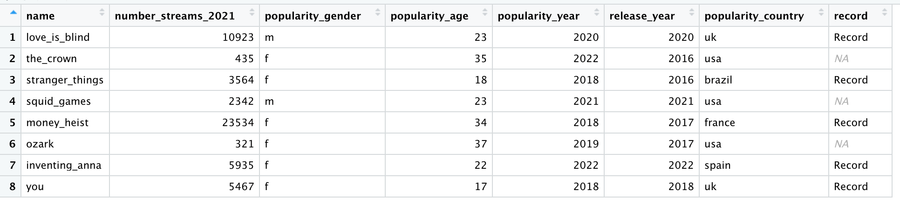
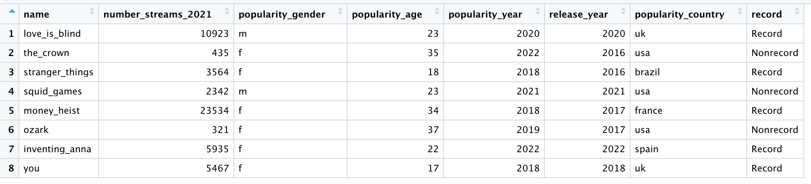

[](images/main_image.jpeg)

### Tutorial Aims

1.  Learn more `dplyr` functions
2.  Be able to apply these functions to efficiently manipulate data
3.  Work thorugh the challenges as you go!

## Steps

#### <a href="#section1"> 1. Loading libraries and data</a>

#### <a href="#section2"> 2. Subset data using `slice()`</a>

#### <a href="#section3"> 3. Move data using `relocate()`</a>

#### <a href="#section4"> 4. Join data using `join() functions`</a>

#### <a href="#section5"> 5. Creating new columns using `transmute()`</a>

#### <a href="#section6"> 6. Descending or ascending columns with `arrange()`</a>

#### <a href="#section7"> 7. Manipulating data under certain condition using `casewhen()`</a>

## Looking further into the DPLYR package

As coders, we want things to be efficient. The more efficient the better! For things to be efficient we want to be in control, therefore we want to be able to **manipulate** the data to the best of our ability. We have learned a few ways to manipulate data using `dplyr` which can be found in the following tutorial <a href="https://ourcodingclub.github.io/tutorials/data-manip-intro/" target="_blank">Intro to Data Manipulation</a>.

However, the `dplyr` package has many more functions that can help us to subset, modify and shape our data. In this tutorial we will be learning a few more of the handy functions that `dplyr` has to offer, they will be explained in a way suitable for **very beginners**! If you have never used R before and this is already abit confusing, don't worry! Head over to this tutorial <a href="https://ourcodingclub.github.io/tutorials/intro-to-r/index.html" target="_blank">Intro to R</a> and come back here once you have got the hang of using R.

In this tutorial the most "advanced" coding we do is using a few pipes `%>%` therefore it is advised that you have gone through the following tutorial <a href="https://ourcodingclub.github.io/tutorials/data-manip-efficient/#piping-graphs" target="_blank">Efficient data manipulations (pipes)</a>. If you have already got the hang of using the functions in `dplyr` head over to <a href="https://ourcodingclub.github.io/tutorials/data-manip-creative-dplyr/" target="_blank">Advanced Data Manipulation</a> for some more advanced application of the functions.

You can get all of the resources for this tutorial from <a href="https://github.com/EdDataScienceEES/tutorial-pippacode">this GitHub repository</a>. Clone and download the repo as a zip file, then unzip it.

<a name="section1"></a>

## 1. Loading libraries and data

Let's begin! In this tutorial we will be working with data sets in the `data` folder in: <a href="https://github.com/EdDataScienceEES/tutorial-pippacode">this GitHub repository</a>. Open `RStudio`, and create a new script by clicking on `File/ New File/ R Script`. Copy and paste the chunks of code provided into your script, using `#` to make useful comments.

``` r
# Title: Introducing more `dplyr` functions
# Name:
# Date: 

# Set the working directory
setwd("your_filepath")

# Load packages----
library(dplyr)

# If you have never used this package, install it using install.packages("dplyr")

# Load tv data
tv <- read.csv("data/netflix_tv.csv")


# Check the tv data
head(tv)   # first few observations
str(tv)    # types of variables
```

As you can see this is not the most scientific data set (nor are the values accurate, they are made up!), however, we will be using this Netflix data to make try and make coding fun...


<a name="section2"></a>

## 2. Subset data using `slice()`

Say we wanted to select/ remove/ duplicate any of the rows in this data set, we can do this using the `slice()` function. It has a number of "helpers" that specify what exactly one would like to slice. In our data set lets say we want to isolate some rows, to do this we can perform the following in R:

``` r
# Slice---- 
slice(tv, n=4)                      # Subset the specified row (in this case row 4)
slice_head(tv, n = 3)               # Allows us to see the first 3 rows in each column
slice_tail(tv, n=3)                 # Allows us to see the last 3 rows in each column
slice_max(tv, number_streams_2021)  # Allows us to see the highest value for number of streams in 2021
slice_min(tv, popularity_year)      # Allows us to see which year was the the least recent in popularity
```

Let's say we only want to look at the top 3 most streamed tv shows in 2021, and we also want a column that contains the duration of time each tv show has been available on Netflix for. Lets do this using some of the dplyr knowledge from the <a href="https://ourcodingclub.github.io/tutorials/data-manip-intro/" target="_blank">Intro to Data Manipulation</a> tutorial and using some pipes!

``` r
tv_duration <- tv %>%                          # Creating new tv frame
  slice_max(number_streams_2021, n=3) %>%      # Selecting top 3 max streams in 2021
  mutate(years_on_netflix=2022-release_year)   # Creates a column for duration of time on netflix
```

Here we have extracted the 3 tv shows with the highest streams per year, and also created a column for duration of amount of time on Netflix for just these three tv shows. This sort of data manipulation could be applied in an ecological sense, because if we have a massive data frame we may only be interested in specific rows, or in this case the highest value rows. Using slice allows us to create a new data frame within the data that we are interested in. Using pipes allows us to apply other functions to the sliced rows.

### **Challenge**

Create a new data frame that only contains the 4 tv shows that were released the longest ago!

<<<<<<< HEAD
### **Answer:**

<details>

<summary>Click here to view answer</summary>

=======

### **Answer:**
<details>
  <summary>Click here to view answer</summary>

``` r
tv_minyear <- tv %>% 
  slice_min(popularity_year, n=4)
  
# Stranger things, Money heist, You, Ozark
```
<<<<<<< HEAD

</details>
=======
  
</details> 


<a name="section3"></a>

## 3. Moving data using `relocate()`

As ecologists know, sometimes when writing data in the field we don't think about how it will look in R, we just go with the easiest and best approach in that moment. As a result, sometimes when it comes time to analyse data in R, we realise that it would make more sense for certain columns to be in a different position to allow for a better comparison or even just because it looks better. This can be done using the `relocate()` function.

``` r
# Relocate ----
tv_country <- relocate(tv, popularity_country, .after=tv_show)
# Have to specify which column you would like to move and after which column you would like it to come
# The same can be applied to moving a column "before" another
```

Here we have moved country next to the tv show column. For me, this is useful when looking specifically at these two column interactions, but also I think it looks correct when placed here, but each to their own so feel free to move around the columns as you wish (not advised to relocate the first column).

### **Challenge**

Move "popularity age" to before the very last column!

### **Answer:**
<<<<<<< HEAD

<details>

<summary>Click here to view answer</summary>

``` r
tv_age <- relocate(tv, popularity_age, .before = popularity_country)
```

</details>
=======
<details>
  <summary>Click here to view answer</summary>
  
``` r
tv_age <- relocate(tv, popularity_age, .before = popularity_country)
```
</details> 


<a name="section4"></a>

## 4. Join data using `join()` functions

<<<<<<< HEAD
Again, sometimes, especially in ecology, we don't collect our data in the most efficient way. Sometimes in the field we do what is best and easiest in the moment. In some cases you might have multiple data sets that you would ideally like to put into one large data set. Rather than going back into excel, or whichever format was used originally to do this, we can use the `join()` function from the `dplyr` package. There are 4 `join()` functions: - `left_join()` - `right_join()` - `inner_join()` - `full_join()`
=======
Again, sometimes, especially in ecology, we don't collect our data in the most efficient way. Sometimes in the field we do what is best and easiest in the moment. In some cases you might have multiple data sets that you would ideally like to put into one large data set. Rather than going back into excel, or whichever format was used originally to do this, we can use the `join()` function from the `dplyr` package. There are 4 `join()` functions: 
-  `left_join()` 
-  `right_join()` 
-  `inner_join()` 
-  `full_join()`


``` r
# Join----
# Load more data
movie <- read.csv("data/netflix_movies.csv")

tv_movie <- full_join(tv, movie)  # This has joined the two data frames together

# Load more data
tv2 <- read.csv("data/netflix_tv2.csv")

tv_join <- left_join(tv, tv2, by= c( "name"= "tv_show"))    # Added column from tv2 to tv that match specified rows
tv_join2 <- right_join(tv, tv2, by= c( "name"= "tv_show"))  # Added columns from tv to tv2 that match specified rows
tv_join3 <- inner_join(tv, tv2, by= c( "name"= "tv_show"))  # Only keeps rows that are in common between the 2 data sets and specified rows
tv_join4 <- full_join(tv, tv2, by= c( "name"= "tv_show"))   # Added both data sets together using specified rows
```

`join()` functions can come in really handy when trying to join two separate yet similar data sets.


<a name="section5"></a>

## 5. Creating new columns using `transmute()`

If you ever find yourself wanting to select one column or multiple columns to isolate and alter it `transmute` is the function for you! Lets say that Netflix made a huge mistake when calculating the streams in 2021, therefore every row in the "number of streams 2021" is incorrect and needs to be multiplied by 100. Instead of using `select` and `mutate`, `transmute` does this for you!

``` r
# Transmute ----

streams <- tv %>% 
  transmute(correct_streams= number_streams_2021 *100)
```

Now lets say that Netflix made *another* mistake... And the column for "popularity age" is too high by one year, how would you not only fix this but create a new data frame that contains the correct "number of streams in 2021" and the correct "popularity age"?

### **Challenge**

Create a data frame with using the conditions stated above!

### **Answer:**

<details>
<<<<<<< HEAD

<summary>Click here to view answer</summary>

=======
  <summary>Click here to view answer</summary>
  

``` r
correct <- tv %>% 
  transmute(correct_streams= number_streams_2021 *100,
            correct_age= popularity_age -1)
```
<<<<<<< HEAD

</details>
=======
</details> 


Isolating and editing columns in this way can come in handy when graphing, if you are only looking to plot two variables it may be easier to visualise the data without all of the surrounding columns.


<a name="section6"></a>

## 6. Descending or ascending columns with `arrange()`

<<<<<<< HEAD
In most cases, the reason we want to have a look at data is to see if there any trends or patterns visible. To see this it tends to help if you can see values in ascending or descending order. This is where the `arrange()` function comes in very handy. This functions allows us to look at column rows in descending or ascending order. This comes in handy visually because it makes it a whole lot easier to notice trends in the data that we would not otherwise see visually. Understanding the general trend and patterns in a data set can also be helpful when trying to plan how you want to analyse the data you have. So, lets say we want to have a look at the "number of streams in 2021" in ascending order firstly then descending order.
=======
In most cases, the reason we want to have a look at data is to see if there any trends or patterns visible. To see this it tends to help if you can see values in ascending or descending order. This is where the `arrange()` function comes in very handy.  This functions allows us to look at column rows in descending or ascending order. This comes in handy visually because it makes it a whole lot easier to notice trends in the data that we would not otherwise see visually. Understanding the general trend and patterns in a data set can also be helpful when trying to plan how you want to analyse the data you have.
So, lets say we want to have a look at the "number of streams in 2021" in ascending order firstly then descending order.


``` r
#Arrange -----

tv %>% 
  arrange(number_streams_2021)

tv %>% 
  arrange(desc(number_streams_2021))  # Specify that you want it in descending order
```
<<<<<<< HEAD

This gives a clear output of the streams in both orders. If you would like your data to be in ascending/desciding order in a new dataframe, then you would just need to specifty that and add an extra %\>% into the mix!
=======
This gives a clear output of the streams in both orders. If you would like your data to be in ascending/desciding order in a new dataframe, then you would just need to specifty that and add an extra %>% into the mix! 


<a name="section7"></a>

## 7. Manipulating data under certain condition using `casewhen()`</a>

Finally, lets take a quick look at the `casewhen()` function. This can be really useful when trying to perform tasks but under a set of conditions. Lets say for example that any tv show that was streamed more than 3000 times has broken a Netflix steaming record and we want to add that to our data table. We would perform the following:

``` r
# Case when -----
record <- tv %>% 
  mutate(case_when(number_streams_2021 >= 3000 ~ 'Record'))  # Specify over 3000
```

Lets have a look at the output data table.



As you can see in the last column, which is the column we just added using mutate and casewhen(), it either says Record or NA. The NA's appear because these rows did not meet the conditions specified in the casewhen() line of code.

<<<<<<< HEAD
Lets change this to make it a touch clearer.
=======
Lets change this to make it a touch clearer. 


### **Challenge**

In the same column create a condition for the rows containing NA values, so that it will now say "Nonrecord".

### **Answer:**
<<<<<<< HEAD

<details>

<summary>Click here to view answer</summary>

=======
<details>
  <summary>Click here to view answer</summary>
  

``` r
nonrecord <- tv %>% 
  mutate("record"= case_when(number_streams_2021 >= 3000 ~ 'Record',
                   number_streams_2021 <= 3000 ~ 'Nonrecord'))
```
<<<<<<< HEAD

</details>

Output:
=======
</details> 

Output: 




Now look at the beautiful column we have created with both conditions specified and no more NA values!!

<<<<<<< HEAD
I love this function and I think you should too!
=======
I love this function and I think you should too! 


<hr>


Well done, you have come to the end of this tutorial. Now that you are familiar with some more dplyr functions feel free to look at the <a href="https://ourcodingclub.github.io/tutorials/data-manip-creative-dplyr/" target="_blank">Advanced Data Manipulation</a> tutorial. In this tutorial we learned:

##### - <a href="#section2"> How to use `slice()`

##### - <a href="#section3"> How to use `relocate()`

##### - <a href="#section4"> How to use `join()`

##### - <a href="#section5"> How to use `trasnmute()`

##### - <a href="#section6"> How to use `arrange()`

##### - <a href="#section7"> How to use `casewhen()`

For more on `dplyr`, read the official <a href="https://posit.co/resources/cheatsheets/" target="_blank">DPLYR cheatsheet</a>.

<hr>

<hr>

#### Check out our <a href="https://ourcodingclub.github.io/links/" target="_blank">Useful links</a> page where you can find loads of guides and cheatsheets.

#### If you have any questions about completing this tutorial, please contact us on [ourcodingclub\@gmail.com](mailto:ourcodingclub@gmail.com)

#### <a href="https://forms.gle/81Bk9JsGQ5faxcMJA" target="_blank">We would love to hear your feedback on the tutorial, whether you did it in the classroom or online!</a>

<ul class="social-icons">

<li>

<h3><a href="https://twitter.com/our_codingclub" target="_blank"> Follow our coding adventures on Twitter! <i class="fa fa-twitter"></i></a></h3>

</li>

</ul>
<<<<<<< HEAD
=======


